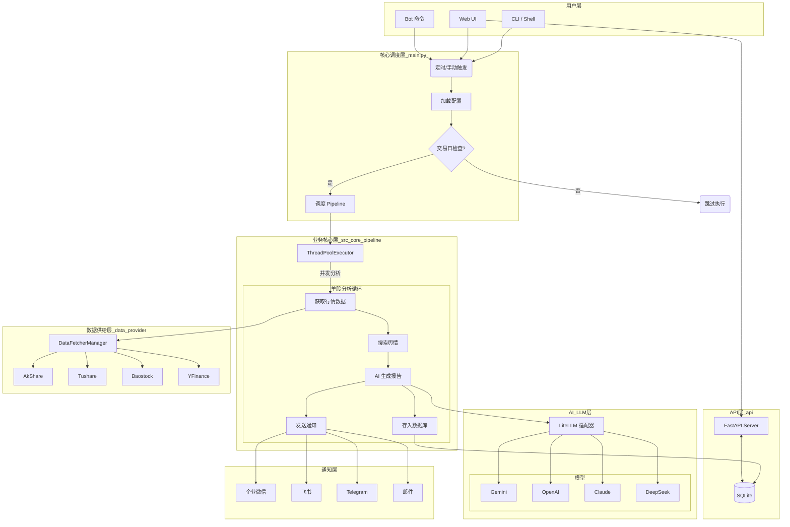

# 股票智能分析系统架构图

### 核心模块职责说明

1.  **入口 (`main.py`)**: 处理命令行参数、交易日判断、定时任务调度。
2.  **流水线 (`pipeline.py`)**: 线程池并发执行个股分析，协调数据获取、分析、通知。
3.  **数据供给 (`data_provider/`)**: 适配器模式，统一不同数据源（AK/TS/BS）的接口。
4.  **AI 分析 (`analyzer.py`)**: 使用 LiteLLM 调用大模型，生成结构化报告。
5.  **通知 (`notification.py`)**: 支持多渠道推送（企微/飞书/Telegram/邮件）。
6.  **API (`api/`)**: FastAPI 服务，提供 Web 管理界面和接口。

